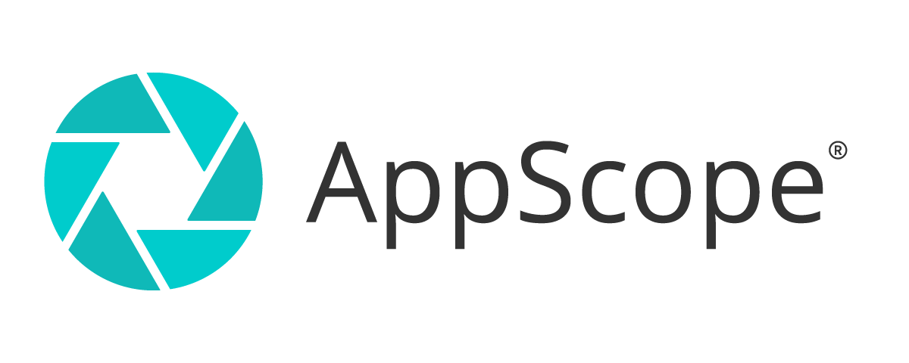
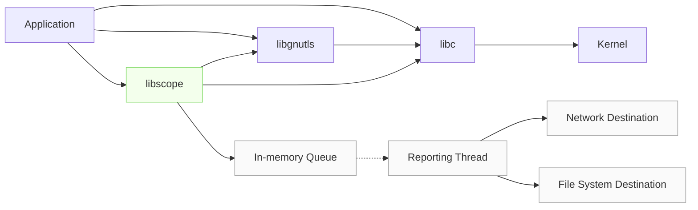

[](https://github.com/criblio/appscope/actions/workflows/build.yml)




AppScope is an open source, runtime-agnostic instrumentation utility for any Linux command or application. It helps users explore, understand, and gain visibility with **no code modification**.

AppScope provides the fine-grained observability of a proxy/service mesh, without the latency of a sidecar. It emits APM-like metric and event data, in open formats, to existing log and metric tools.

It’s like [strace](https://github.com/strace/strace) meets [tcpdump](https://www.tcpdump.org/) – but with consumable output for events like file access, DNS, and network activity, and StatsD-style metrics for applications. AppScope can also look inside encrypted payloads, offering WAF-like visibility without proxying traffic.

<br />
<br />



## 🚀 Try It Out

Before you begin, ensure that your environment meets the AppScope [requirements](https://appscope.dev/docs/requirements).

**With the Download**
```
LATEST=$(curl -Ls https://cdn.cribl.io/dl/scope/latest)
curl -Lo scope https://cdn.cribl.io/dl/scope/$LATEST/linux/$(uname -m)/scope
curl -Ls https://cdn.cribl.io/dl/scope/$LATEST/linux/$(uname -m)/scope.md5 | md5sum -c 
chmod +x scope
scope <some app>
scope metrics
sudo scope attach <already running process>
scope events -f
scope detach --all
```

**With Docker**
```
docker run --rm -it -v/:/hostfs:ro --privileged cribl/scope
scope <some app>
scope metrics
scope events
scope attach --rootdir /hostfs <process running on host>
scope events -f
scope detach --all --rootdir /hostfs
```

## ℹ️ Resources

On the [AppScope Website](https://appscope.dev/) you can:

- Learn about the CLI commands [in more depth](https://appscope.dev/docs/cli-using).
- Get an [overview](https://appscope.dev/docs/how-works/) of AppScope beyond the CLI.
- Discover what people are [doing](https://appscope.dev/docs/what-do-with-scope) with AppScope.
- Review advanced [examples](https://appscope.dev/docs/examples-use-cases).
- View the [Changelog](https://appscope.dev/docs/changelog) and [Known Issues](https://appscope.dev/docs/known-issues).
- See what happens when you [connect AppScope to Cribl Stream or Cribl Edge](https://appscope.dev/docs/cribl-integration).

_The content on that site is built from the [website/](website/) directory in this project._

Elsewhere, you can:

- Complete the [AppScope Fundamentals sandbox](https://sandbox.cribl.io/course/appscope), a tutorial that takes about 30 minutes.
- Join the [Cribl Community](https://cribl.io/community/) on Slack. The `#appscope` channel is where you'll find developers who contribute to this project.

## 🔧 Build From Source

AppScope is not built or distributed like most traditional Linux software.

- Insofar as possible, we want AppScope binaries to be  **Build Once, Run Anywhere**. To approach this goal, we build with a version of glibc that is (1) recent enough that the resulting binary contains references to versions of functions in the glibc library *that are still supported in the latest glibc*, yet (2) old enough that the binaries can run on a wide range of Linux platforms without having to rebuild locally.
.
- We don't build OS installation packages like DEBs or RPMs. This way, when you want to investigate a running system or build a custom container image, you can simply drop AppScope in and use it.

Pull a copy of the code with:

```text
git clone https://github.com/criblio/appscope.git
cd appscope
```

If you are on Ubuntu, install the build dependencies with:

```text
./install_build_tools.sh
```

Then, build and test the code with:

```text
make all test
```

If you aren't on Ubuntu, or would prefer not to install the dependencies, ensure that [Docker], [BuildX], and `make` are installed, then build in a container with:

```text
make build
```

Either way, the resulting binaries will be in `lib/linux/$(uname -m)/libscope.so` and `bin/linux/$(uname -m)/scope`.

We support building `x86_64` (amd64) or `aarch64` (arm64/v8) binaries by adding `ARCH=x86_64` or `ARCH=aarch64` to the `make build` command. See the [BUILD](docs/BUILD.md) doc for details.

## ✏️ Contributing

If you're interested in contributing to the project, you can:

- Take a look at current [discussions](https://github.com/criblio/appscope/discussions) and [issues](https://github.com/criblio/appscope/issues) in GitHub.
- See our developer guides in the [docs/](./docs/) directory in this repository.
- Submit any feature requests and defect reports at <https://github.com/criblio/appscope>.
- Join the [Cribl Community](https://cribl.io/community/) on Slack. The `#appscope` channel is where you'll find developers who contribute to this project.

## 📄 License

AppScope is licensed under the Apache License, Version 2.0. 

[Docker]: https://docs.docker.com/engine/install/
[BuildX]: https://docs.docker.com/buildx/working-with-buildx/
