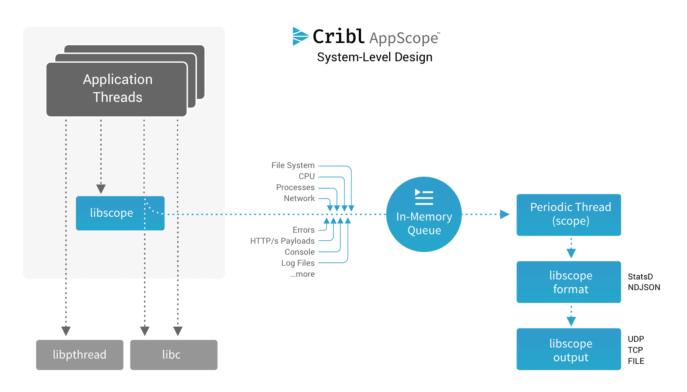

# AppScope Design

AppScope is an application-centric instrumentation and data collection mechanism. With one instrumentation approach for all runtimes, AppScope offers ubiquitous, unified instrumentation of any unmodified Linux executable. It&#39;s equally useful for single-user troubleshooting or monitoring distributed deployments.

So how does it work? Fundamentally, AppScope uses an _interposition_ model. AppScope uses several interposition approaches; more on this [here](Interposition_Mechanisms.md). The design operates in user mode, with no kernel component.

Specifically, AppScope is based on function interpositioning. It&#39;s not a new concept. An application consists of modules that are part of the application executable, modules from other application components, and modules from the underlying OS. Code in modules external to the executable are normally accessed as a library – a shared library or a dynamic library. The application makes calls to any number of functions within the library or within its own executable. Any of these function calls can be interposed.

Interposing a function call implies that the application itself is not not aware, or at least does not need to be aware, of the interposition. Normally, a function call is made to a known address, and the function returns to the caller. With interposition, the application similarly calls a function at a known address, the interposed function extracts information as needed, and then it calls the original function. A return to the original caller occurs as if the interposition never happened. 

For example, an application calls the function `fwrite` to write data to a file. The function `fwrite` is in a library, most often an OS-provided library. Let&#39;s call it `libc\_fwrite`. The address of `libc\_fwrite` is determined by the linker or the dynamic loader.

When `libc\_fwrite` is interposed, it means that the original address for `libc\_fwrite` is updated to point to a different function; let&#39;s call it `i\_fwrite`. The interpose mechanism saves the address of `libc\_fwrite`. Now when the application calls `fwrite`, `i\_fwrite` is executed first. Then, `i\_fwrite` extracts detail about the write operation as needed, calls `libc\_write`, and returns the results of `libc\_write` to the application caller. Simple, right?

Information extracted from interposed functions is stored in an in-memory queue. Updating information in-memory allows us to manage performance: We&#39;re not incurring I/O or IPC overhead in order to extract details from an application. We simply place the detail we extract in the queue, and control is returned to the calling application function.

In order to emit the extracted information for use by external systems and analysis, AppScope creates a reporting thread. The thread executes on a configured period (every 10 seconds by default). The thread reads from the in-memory queue and exports the information as formatted data. Metrics are exported in either StatsD or NDJSON format. Events are exported in NDJSON. Output can be any network connection or file.

The diagram below shows the general architecture of AppScope including it's export mechanism.

Given the export model, you can feed information to various systems. Metrics in StatsD form can be sent to DataDog, logs in NDJSON form can be sent to Splunk, and events can be sent to New Relic. To name a few.

One of the more powerful export connections is Cribl LogStream. A connection to LogStream allows information to be filtered, reduced, redacted, formatted, and delivered to virtually any destination. LogStream ships with an AppScope Source (input configuration), making it easy to establish a streaming endpoint for all AppScope data.

LogStream also supports a remote management capability for AppScope. This means that you can manage the specific configuration of any and all application processes from the LogStream UX. Check out this combination by [downloading LogStream](https://cribl.io/download/).
