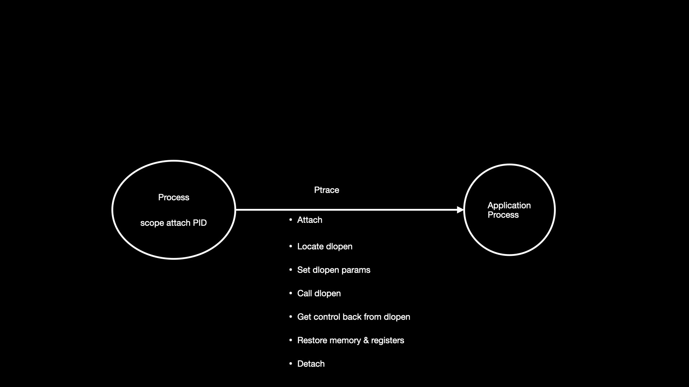
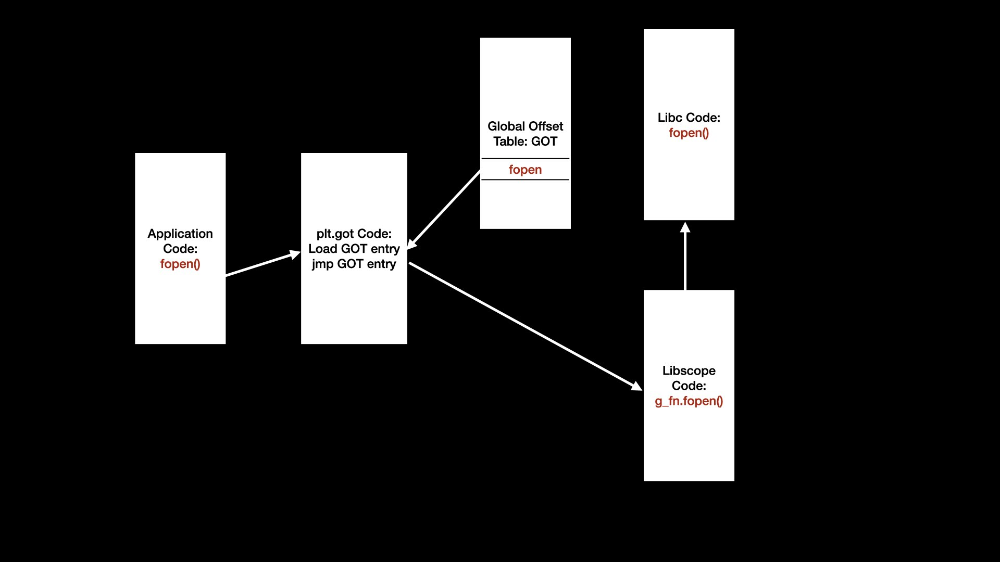
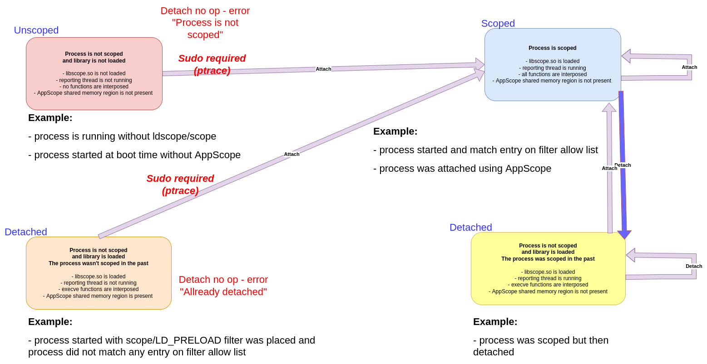

# Attach to a Running Process

AppScope is able to extract detailed information describing the operation of a running application. This is accomplished by loading a library into the address space of a process and establishing a number of interposed functions. Until recently, the library has been loaded at the time a process is started. With the 0.7 release the ability to attach to a running process is introduced. In this case, attach implies connecting to a running process, loading the library, establishing interpositioned functions and emit metrics and events based on the behavior of the attached process.

## Design

The design approach follows well established patterns. We use `ptrace` to attach to a process. This requires root user access, **SYS_PTRACE** capability in a container and the **PID** of the process to be attached.

We use `dlopen` to load the libscope library. Therefore, it is a matter of finding the address of `dlopen` in the attach process, setting up parameters and calling `dlopen`.

When libscope is loaded the library constructor is run and it determines that we are attaching and performs GOT hooking on a list of functions. This establishes interposition and detailed data extraction begins.  

## Issues

We quickly ran into several issues.

1. How to configure the library in an attached process
1. All musl libc based processes would segfault when attached
1. python3 segfaults when attached

### Library Configuration

When the libscope constructor runs it looks for environment variables and a config file in several predefined locations. We really wanted the constructor to be able to locate the config created by the `scope` CLI. However, we need to define an environment variable to point to the session dir from the CLI. Passing env vars to a running process is not normally done. So, before executing `ptrace` attach and calling `dlopen` we write the env vars we want the libscope constructor to use into a file in `/dev/shm.` When the constructor runs, it locates the file and exports the defined env vars. This causes libscope to use the config created by the CLI. With this approach, we can attach and then begin interacting with the results using the CLI. For example:

    sudo scope attach PID
    sudo scope events
That command sequence will attach to the process defined by PID. The events generated by the attached process are readily exposed.

To detach from the process

    scope detach PID
### Debug

Library constructor code is run in the context of the loader, ld.so. This turns out to be a highly constrained context. We can't readily write to stdout or log to files. Moreover, because we are attaching, we can't also attach with a debugger.

This resulted in drawing a few conclusions by looking at the code and suspected behavior. Of course, the conclusions were all inaccurate. We actually used a form of a breakpoint to see what path was being taken with the code sequence; `while (1) sleep(1)`. That, of course, is ridiculous and didn't help much.

We became convinced that the issues we were seeing were caused, at least in part, by the constructor running multiple times due to calling `dlopen` of libscope multiple times. This turned out not to be the case. We were able to prove that after finding a way to get debug statements out of code running in the constructor.

We mmap'd a section of unused memory and extended the `scopeLog` function to write to the mapped memory instead of a log file. Then, we caused an interposed function that we know would be called by the application and added a `sleep(30)` at the front of the function. We modified constructor code to not execute code causing the segfault so that we could get through the constructor and get into the interposed function. While in the sleep function we could connect `gdb` and look at the log data in mapped memory.

In the python3 case, we started the built-in python web server with `python3 -m http.server` and used curl to hit that server with `curl localhost:8000`. We added the `sleep(30)` to the `recv` interposed function. After attaching and loading libscope into the python process we sent a get request to the server with curl and then attached gdb during the 30 second delay. At that point we were able to examine logs in mapped memory.  

Given the ability to see details of constructor execution it became clear that the constructor was called once and only once. With memory based logs we were able to move forward to determine specific issues.

### Musl Libc

The design and implementation of musl libc is impressive. It works well and appears to strictly conform to POSIX and Linux specs. The gnu loader is fully featured and handles all number of corner cases. As such, it is possible to *get away with* behavior that is not strictly correct. Use of ld.musl.so exposed several places where we were *getting away with* things that the gnu loader fixed for us.

During the attach sequence, the symbol search algorithm used by ld.musl.so requires that the search starts with the executable object and not the next object. This implies that `dlsym` needs to use the `RTLD_DEFAULT` handle and not `RTLD_NEXT`. When `RTLD_NEXT` is used the symbols required in the `g_fn` structure are not resolved and that, of course, causes issues. The requirement to start at the executable makes sense in the context of attach. This required that we determine if we are attaching at the time `g_fn` is initialized. That required a bit of thought. In the end, a simple approach is in place.

The next issue we encountered using ld.musl.so was in walking through all the dynamic symbols in the attached process during constructor execution. The address values defined in the .dynamic section are virtual addresses that should be computed based on the original file value and the memory base address. In some cases, on a glibc distro, the base address as defined in the link map is 0. Therefore, the address values in a .dynamic section were used directly, without adding a memory base address. This was not the case on a musl libc distro. Of course, attempting to use a `d_un.d_ptr` from a .dynamic section without adjusting to the base address causes a segfault where the base address needs to be applied. Therefore, adding the base address from the corresponding link map resolves the issue. Which is, of course, correct behavior.

In other cases, we found that the virtual addresses were not an offset and the base address was not 0. Of course, in this case the base address can not be added to a `d_un.d_ptr`. Given the apparent variation we added a check to determine if the address defined in a `d_un.d_ptr`can be found in the process address space. If it is found, we do not add a base address. While this approach feels a bit uncomfortable it appears to function correctly in all test cases.

### Python3

The issue with python3 turned out to be difficult to understand. Once we understood, it was a one line code change. The issue originated in the GOT hooking code.

When GOT hooking we have 2 arrays that need to be managed; 1) the GOT entries and 2) the `g_fn` entries. The GOT entries are updated to cause the interposed function to be called by the application. The `g_fn` functions represent the original function called from the interposed function.

Once we were able to see details by using the memory based logs it became clear that the GOT entries were accurate. The location of the GOT and entries along with the values being updated were accurate. When we update the GOT entry we assign the previous GOT entry to the corresponding `g_fn` entry. For example, the GOT entry for `fclose` is updated to call the `fclose` interposed function in libscope and `g_fn.fclose` is updated with the original value from the GOT entry. Works great...except in the case where the `g_fn` function is used during constructor execution.

There are 2 values that the original GOT entry will have; 1) the value assigned at initial load time when lazy loading is used and 2) the actual value of the function used by the application.

We experienced functions that worked as expected, some with initial values from lazy loading and some with glibc values. We also experienced fclose causing a segfault. Several functions are used in the context of the libscope constructor. Why does fclose cause a segfault and others not? When we disabled lazy loading by setting the `LD_BIND_NOW` env var, `fclose` worked without issue. So, we knew that lazy loading was a factor, but still could not tell why some functions appeared to work with GOT entries with initial values and `fclose` did not.

Further analysis of the GOT activity revealed that `fclose` was unique in that its' GOT entry was initial, from lazy loading, and it was called in a constructor context. Other functions whose GOT entries were initial were not being called in the constructor context. The fact that `fclose` worked when lazy loading was disabled meant that the GOT entry for `fclose` was from glibc in a direct link mode.

So, functions with initial GOT entries and not called in the constructor do not result in a segfault while functions with initial GOT entries and called in the constructor result in a segfault. This implies that ld.linux.so behaves differently when the lazy loader code is executed when a library is being loaded from `dlopen`. The glibc code for `dlopen` does include an ability to recognize an initialized and active ld.so. This implies that there is a difference in function resolution in a library constructor context.

In recognition of the difference in initial GOT entry value in a library constructor context, we added a check in the GOT hook code that does not update the `g_fn` value if we are attaching. This resolves the segfault caused by `fclose` and allows attach to a python3 process without issue. The good side of this change means that we do not need to make exceptions in use of `g_fn` functions when executed in the constructor. Should an application update a GOT entry we will ignore it. That may pose a problem that will require us to change this approach. For now, we have taken steps to understand the behavior of initial value updates by ld.linux.so and that has allowed us to proceed with attach behavior.

### Symbol Resolution

We need to adjust to how ld.so, libdl, dlopen, dlsym together resolve symbols. Several use cases have revealed different behavior as symbols are resolved. We have been able to resolve symbols for g_fn using the `RTLD_NEXT` handle with `dlsym()`. That has worked in all preload cases. When we added an attach feature it was revealed that symbols were not resolved as expected in several cases. The context in which the library is loaded and therefore, the context in which the constructor is run, is quite different as compared to process load time when preload is applied. Resolving symbols at load time versus run time, or preload versus postload, is, in many cases, quite different. In the attach case the lib constructor is run after all required libs have been loaded. In the post load attach case we will see ld.so resolve symbols from libscope where they need to be resolved by system libs; libc, libpthred,libdl, et al.

It becomes important to note that the handle obtained by `dlopen()` and used with `dlsym()` is a starting point. That is, the symbol search can be made to start at a specific object, but it is not limited to the symbols defined by that object. In fact, the starting point defined by a handle defines a hierarchical walk of the symbols defined by ld.so. For example, a handle returned by dlopen("libdl.so") will search symbols in libdl.so. If the symbol is not resolved the search will continue to include shared objects that are required by libdl.so and then those used by the executable at large.

In the libscope.so case there are several dependent libs; libc, libdl, librt, libpthread, ld.so. In general, a hierarchy exists, not quite literal, but in practical terms, libc is not dependent on other libs. Likewise, libpthread is dependent on libc and librt is dependent on libpthread and libc. We make use of this dependency by starting a symbol search at librt. The search order becomes librt, libpthread, libc, executable. The intent is that a symbol will be resolved by librt or libpthread before libc. There are duplicate symbols in libs. For example, the function `read()` is defined in libpthread and libc. The idea being that some symbols in libc are utilized for single threaded apps where the overhead of locking is not needed. The use of weak symbol definitions allow the duplication to work. We want to resolve to thread safe implementations where they exist. Therefore, if a symbol could be resolved in libpthread and libc, we'd like to resolve from libpthread.

In general, what we've done is walk all objects in an executable using `dl_iterate_phdr()`. We use a call back function that causes a symbol search that starts at librt. This is accomplished with a dlopen("librt") and a `dlsym()` with the resulting handle.In a GNU libc distro this resolves most symbols from libpthread and libc.

A musl libc distro doesn't contain a lib hierarchy such as that found in a GNU libc based distro. There is, for the most part, a single lib that includes all supported POSIX definitions in a musl libc distro. Therefore, the act of walking all shared objects, starting with librt doesn't function the same in a musl libc instance. Symbols aren't resolved in this case. We add a second clause to symbol resolution to use the `RTLD_NEXT` handle with `dlsym()` in order to resolve symbols in the musl libc case. This works well for preload and postload cases with the exception of static execs.

On a musl libc distro symbols from a static executable cannot be resolved with the `RTLD_NEXT` handle. Presumably, there is no next in the static exec. It makes sense in that all of the functions are fully resolved and resident in the exec. Therefore, starting a symbol search from an object after the exec could be seen as problematic. This can be confusing as the use of the `RTLD_NEXT` handle in static exec works with ld-linux.so, the GNU loader.

In order to effectively support static execs we add a clause to symbol resolution to detect a static exec and use the `RTLD_DEFAULT` handle with `dlsym()`. While this is not strictly required in a GNU libc distro, it does appear to be correct behavior. We see that ld-linux.so resolves symbols as expected on static execs with `RTLD_DEFAULT`.

It's important to note that the use of `RTLD_DEFAULT` in a dynamic exec generally results in symbols being resolved from libscope. Therefore, we need to use this handle in a static exec case only. It makes sense in that `RTLD_DEFAULT` causes a symbol search to begin with the current object. When executed from the libscope constructor, this results in symbols that we want to locate in libpthread or libc to be resolved from libscope. That doesn't work.

### Detach/Reattach

With release 1.2.0 we introduced fundamental changes in attach usage model. We separate loading AppScope library into a process and interposing the process functions. This allows us to establish `detach` feature.

The `ptrace` ability is required for first attach.

To transit between other states presented below we are use dynamic configuration file.

### Container awareness

With release 1.2.0 we introduce container awarnesss to attach functionality. We are able to attach to the process from host into container.
`scope` is able to identify that desired process which we want to attach exists in different Linux namespace(s), in other words exists in a container.
When the situation above happened it is detected and we reassociate currently running thread in `scope` with container `pid` and `mnt` namespaces.
`mnt` namespace is required to copy `scope` from host to container, because container do not have access to host mount namespace. We also required to switch `PID` namespace which we cover later in this paragraph.
After switching namespace we perform `fork` & `exec` operation to run `scope` which was previously copied. The new process will run in container context with modified the PID argument compared to original ran in host context.
From container we are not able to see host `pid` namespace so we are required to translate PID to the value visible in the container (`pid` namespace).

The detach/reattach operations are supported as well.

We are able to pass desired configuration file via `SCOPE_CONF_PATH`. What this means is that in addition to copying `scope` we are able to copy desired scope configuration from host to container.

We are able to perform attach to host process /other container process by `scope --starthost` operation.
