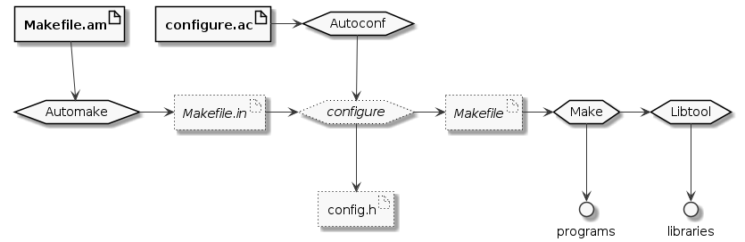

# Cribl AppScope - Build System

We use a _simple_ Autotools setup so we can build and test the code with the
commands below. See the [Autotools Primer](#autotools-primer) at the end for an
introduction to the concept.

```shell
git clone git@github.com:criblio/appscope.git
cd appscope
./bootstrap
make
make check
```

Enable debugging with `./bootstrap --enable-debug`. Any arguments to
`bootstrap` are passed along to `configure`. Run `./configure --help` to see
the myriad of options available.

The `bootstrap` script will check for a number prequisites needed to build the
code and prompt for permission to install them; i.e. GCC, Go, Make, Autoconf,
Automake, etc. Set `NO_PROMPT=1` in the environmnent to bypass those prompts
and just install whatever is missing.

Set `DEBUG=1` to get additional logging from the `bootstrap` script.

```shell
$ DEBUG=1 FORCE=1 ./bootstrap --enable-debug
debug: OS is "linux"
debug: SUDO is "sudo -E "
debug: INSTALL is "sudo -E apt -y install"
===============================================================
info: Checking Dependencies
===============================================================
debug: Checking for program go in path.
Found go at /usr/local/bin/go.
...
===============================================================
info: Generating Build System
===============================================================
autoreconf: Entering directory `.'
autoreconf: configure.ac: not using Gettext
autoreconf: running: aclocal --force --warnings=no-override -I m4
autoreconf: configure.ac: tracing
...
autoreconf: Leaving directory `.'
===============================================================
info: Running ./configure --enable-debug
===============================================================
checking for a BSD-compatible install... /usr/bin/install -c
checking whether build environment is sane... yes
checking for a thread-safe mkdir -p... /usr/bin/mkdir -p
...
config.status: executing depfiles commands
config.status: executing libtool commands
===============================================================
info: Build System Ready. Run make.
===============================================================
$ 
```

The make targets typical for Autotools projects are provided.

* `make` builds everything
* `make check` builds if not already done then runs the unit tests
* `make clean` removes the built objects and binaries
* `make maintainer-clean` also removes the generated build system pieces

We have a couple extra targets in the top-level Makefile for building in Docker
containers. See [DEVELOP.md](./DEVELOP.md#docker-run) for details.

## Autotools Primer

Autotools consists of Autoconf, Automake, Libtool and Make. We maintain the
top-level `configure.ac` file and `Makefile.am` in each directory where we
build things. Autotools is responsible for turning all that into the
`Makefile`'s we need to build, test, package and install the code. The diagram
below outlines the scheme.



Run the `bootstrap` script to initialize the build system. It runs Autoconf
which loads our `configure.ac` file and runs Automake. It then runs the
generated `configure` script to complete the build system setup. Once that's
done, we run `make` to build, `make check` to test, `make dist` to build the
source distribution tarball or `make install` to install into `/usr/local/`.

See [Autotools Mythbuster](https://autotools.io/) for more details.

## Migration Notes

> Planning to remove this section once the migration is done.

* The `configure` script will generate `config.h` which defines macros based on
  what it figures out about the build host. It should be included in C/C++
  sources where we need access to those macros. Include it with the guards as
  shown below.

  ```c
  #ifdef HAVE_CONFIG_H
  #include <config.h>
  #endif
  
  // now we can do things like...
  
  #ifdef HAVE_PCRE2_H
  #include <pcre2.h>
  #endif
  ```

* Needed to `#include "os.h"` in various places to be able to use numerous
  structs and typedefs. We end up with lots of superfluous include
  dependencies. Consider whether we should work on trimming the includes down
  to what's actuall necessary. Perhaps overly retentive...

* GCC already defines `__linux__` (lowercase!) and `__APPLE__` on these platforms
  so we don't need to use `__LINUX__` and `__MACOS__` but I'm leaving them for
  now. I have logic in `configure.ac` to set them instead of using `scope_env.sh`.

  Sometime soon, we can just:

  ```shell
  sed -i "s/__LINUX__/__linux__/g" src/*.h src/*.c
  sed -i "s/__MACOS__/__APPLE__/g" src/*.h src/*.c
  ```

* Not really related to the build system migration but while working on this,
  I ran into issues the ended up caused by the newer glibc I have on this host.
  I ended up having to make a couple code adjustments:

  * `_STAT_VER` is no longer in `stdio.h` or elsewhere so I replaced it with `1`
    at Donn's direction in `os/linux/os.h`.

  * `fwrite_unlocked` is a macro in `bints/studio.h` now so where we're trying
    to wrap it in `src/wrap.c`, we get an ugly compiler error. I've wrapped that
    code in a pragma to disable the macro temporarily and re-enable it after.

* I've attempted to pull the logic that's in `install_build_tools.sh` into the
  `./bootstrap` script. Like the original, it won't install packages if the
  programs are already available. Setting `DEBUG=1` enables more detailed logs.
  Setting `FORCE=1` bypasses the prompts before installing packages.

* The build system initializes now on Ubuntu, CentOS, MacOS and Alpine. The 
  actual build works on Ubuntu and CentOS. It fails on MacOS and Alpine but this
  is currently as expected.

* `make check` runs the test suites in `cli/` and `test/`. The CLI tests seem
  to run without issue. The compiled tests in `test/` build now but many are
  failing. Need to look deeper at the specific faults.

* Ideally, the new `bootstrap` script can replace `install_build_tools.sh` and
  `scope_env.sh`. Need some feedback on that.

* TODO:
  * Move `docker/build.sh` logic into a Makefile.am
  * Recurse into `docs/images`
  * Remove top-level `bin/` and `lib/` folders
  * Remove `test/linux/` and `test/macOS` folders
  * Remove legacy Makefiles
  * Finish integration of `test/`
  * `make dist`
  * RPM & DEB packages?
  * coverage in `cli/` and `test/`
  * "integration" tests in `test/testContainers`

