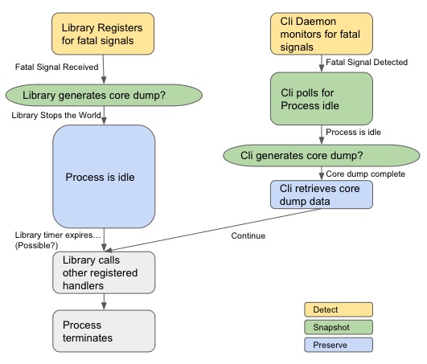

# AppScope Debug Design

When a process crashes it can be a challenge to get enough information to help developers troubleshoot the situation. Some examples of the difficulties... it can be hard to reproduce the crash outside the environment where the crash was first seen. Container environments are typically very transient so it can be tough to obtain shell access. Container storage that might give clues many not persist after the container has exited. Installation of debugging tools may be challenging or undesirable. Even outside of containers the procedure to turn on kernel-provided core dumps often varies by linux distro and can be a security liability (particularly with DOS attacks). It can even be challenging to know whether AppScope is playing a role in the crash itself.

## Perceived Requirements

* Capture and preserve a snapshot so that developers can determine the cause of a process crash.
* Take snapshots from containers as well as VMs and hosts, so that the user has a consistent experience.
* Provide settings to conditionally enable debugging features so that users can select features per their needs.
* Allow the AppScope library and AppScope cli to operate independently so that users are not required to run both.

## The state of things today

As of today, AppScope has one mechanism to report debugging information in the event of a crash. If the environment variable SCOPE_ERROR_SIGNAL_HANDLER is set to "true", and the AppScope library detects one of a number of signals that will result in the abnormal termination of the host process, it can output a stack trace of the offending thread to the AppScope log file before terminating. This doc is intended to be a discussion of how we might improve and extend AppScope's error handling.

## Steps and flow of control

There are three things that we expect to be common with any approach to debugging crashes. Firstly, there has to be a way to **detect** that there is a problem. Secondly, we have to take a **snapshot** of pertinent information while the problem exists. Lastly, we need to **preserve** the snapshot so the debugging can take place at a later time. At this time we will not consider the additional steps of notifying developers or transferring the snapshot to the developers.

Among other things, the discussion that follows tries to address pros and cons of performing these steps from inside the crashing process vs from outside the crashing process. What coordination is needed between the two?

## Detect that the process is crashing

To talk about detection from the perspective of our library inside the process: we can register for signals that will result in abnormal termination of the process we're in. One concern is that it is possible that the process we're in has already registered handlers for signals that we are also interested in. Our current approach is to not register our handlers by default, but only register our handlers when instructed to. For crashes that happen very infrequently it may be frustrating to need to restart the process with different settings. It may be necessary to try to register our handlers, call them first, and then call any handlers the process installs. This is more complex, and we may not understand possible timing windows with this approach.

To talk about detection from the perspective of an external process or daemon:
We could launch a process (daemon) to detect unhealthy processes. Two examples of how this could be done include 1) using eBPF to observe signals, or 2) pinging the process and detecting timeouts. We believe that external detection alone can not respond quickly enough to preserve the state of the crashing process.

## Take a snapshot (coredump, stack trace, etc)

To talk about snapshotting from our library inside a process: we have libunwind implemented today, and have a solid start on coredumper. The primary coredumper repo doesn't directly support aarch64 nor Musl-based systems. We're investigating whether this has been resolved on other forks, or if existing PRs may provide a solution to this. As a negative of performing the snapshot from inside the library, it's a very [constrained](https://man7.org/linux/man-pages/man7/signal-safety.7.html) operating environment. As an example, our new [IPC mechanism](https://github.com/criblio/appscope/issues/1108) is powerful, but depends on a lot of functionality that is not available from inside a signal handler. As a positive, code here can be made to be portable, and avoid any external (dynamically loaded) libraries or applications.

For snapshots taken from outside the library: from the discussion above about crash detection, it would require some help from the library to freeze the process (aka "stop the world") in a state where we can snapshot it from outside the process. Anything done from outside the crashing process has the clear benefit of being free of the severe signal-safe constraints. We don't yet know if there are existing go libraries that may allow us to generate a core dump from userspace (perform an operation equivalent to gcore or gdb's "generate-core-file" functionality). Without knowing about applicable go libraries, it's possible that it might be challenging to perform this function. Bundling one of these utilities is not super attractive, but is a possibility.

A note to keep in mind about core dumps: without external information for context, core dumps are of limited use. To make full use of a core file the elf files of the application and it's dynamic dependencies are needed... it's unclear how much of this contextual information to capture. On one end of the spectrum we could choose to include the application and all dependencies in the snapshot. On the other end we could try to convert predefined parts of the corefile into text while in the environment where the core dump is taken. The first option here is large but very usable, the second is small but looses some fidelity. If it helps this discussion, stack traces are an example of the second (textual) capture where we can see the nesting of functions in text, but have lost the values of arguments associated with each function call.

## Preserve the snapshot for future debugging

To preserve the snapshot it seems like it will take cooperation of the library and cli. If we have the library generate the snapshot, our initial thought is to write the snapshot to someplace on the filesystem, like /tmp or /dev/shm, then stop the world. It's also possible that the library could send this information to some listener (meaning socket and send are signal-safe). This requires that a destination (cli?) is available and that we don't need to resolve DNS (not signal-safe) for example. After taking the snapshot and writing or sending it, the library must stop the world to prevent the process from terminating (causing containers to terminate before we've retrieved the snapshot). If we have the cli generate the core dump, we still need the library to stop the world to give the cli a chance to take the core dump. Regardless of how the core is generated, the cli needs to retrieve the information since it alone is capable of reaching inside a container, if there is one. eBPF seems like a very attractive mechanism for the cli to know that there is a crash trace to retrieve. Sending a signal from the scoped process to the cli will not be possible if the cli is in a different pid namespace.

After the snapshot is retrieved by the cli, then we ideally want the scoped process to resume its signal handling. When the cli is done gathering the snapshot, it could send a SIGCONT to the crashing process to "un-stop the world". Admittedly, this seems fragile because it requires that we have the cli running as a service or daemon for it's role in this scheme. As another important comment, it's unclear if delays we add to process termination could cause problems with container orchestration tools. It also seems like we would have to be careful to call any preexisting crash handling that the host process might have been trying to do. We want our library to be as transparent as possible w.r.t. termination behavior.

## Ok, but what is in this snapshot thing?

Despite the way we've talked about snapshots above, we want to collect more than a simple stack trace and/or core dump. And we may collect this information from more than one source. For one snapshot, some information may be collected by the Cli, while other information could be collected by the AppScope library. Here are initial thoughts on what Debug Information we would like to include in a snapshot for MVP. The second column describes where (which source) we may use to capture that Debug Information. A "-" in the second column means we do not plan to include this information in the initial (MVP) release.

| Debug Information | MVP |
| --- | --- |
| Time of Snapshot | cli |
| AppScope Lib Version | lib |
| AppScope Cli Version | cli |
| Process Name | cli |
| Process Arguments | cli |
| PID, PPID | cli |
| User ID/ Group ID | cli |
| Username/ Groupname | cli |
|  |  |
| AppScope configuration | lib |
| Environment Variables | cli |
|  |  |
| Signal number | cli |
| Signal handler | cli |
| Error number | cli |
|  |  |
| Machine Arch | cli |
| Distro, Distro version | cli |
| Kernel version | cli |
| Hostname | cli |
| Namespace Id's | cli |
| Container Impl (docker, podman...) | - |
| Container Name/Version(?) | - |
| SELinux or AppArmor enforcing? | - |
| Unix Capabilities...  PTRACE?... | - |
|  |  |
| AppScope Log Output | if possible |
| scope ps output | cli |
| scope history output | cli |
|  |  |
| Stack Trace (offending thread) | if possible |
| Stack Traces (all threads) | lib |
| Memory (stacks, heap) | lib |
| Registers | lib |
|  |  |
| Application version(?) | - |
| JRE version (if java) | cli |
| Go version (if go) | cli |
| Static or Dynamically linked(?) | cli |
|  |  |
| Network inferface status? | - |
| ownership/permissions on pertinent files/unix sockets | - |
| dns on pertinent host names | - |

> Consider:
>    Attach?
>    Arch?
>    Musl?
>    Where is snapshot captured?
>    Is a listener (daemon) **required** to get stack traces?
