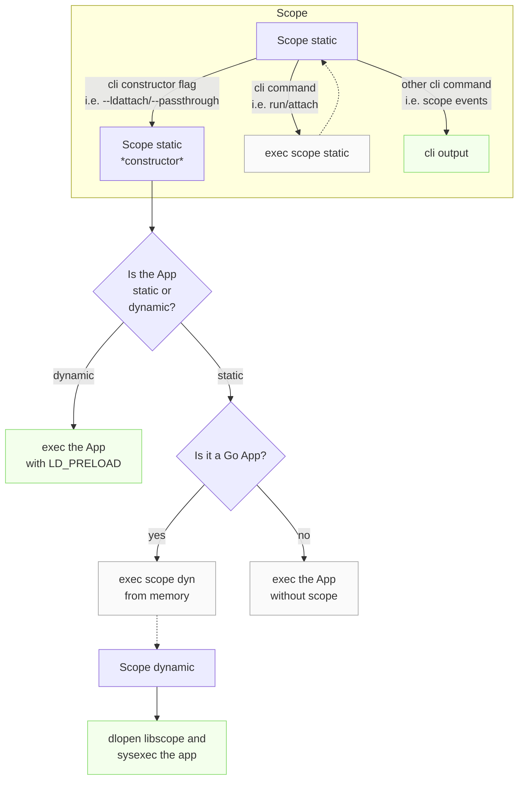

```mermaid
graph TD
    A[Scope static \n *constructor*]
    A --> B{Is the App \n static or \n dynamic?}
    B -->|dynamic| C[exec the App \n with LD_PRELOAD]
    B -->|static| D{Is it a Go App?}
    D -->|yes| E[exec scope dyn \n from memory]
    D -->|no| F[exec the App \n without scope]
    E -.-> I[Scope dynamic]
    I --> H[dlopen libscope and \n sysexec the app]

    subgraph Scope
    S[Scope static]
    S-->|cli command \n i.e. run/attach| T[exec scope static]
    T -.-> S
    S-->|cli constructor flag \n i.e. --ldattach/--passthrough|A
    S-->|other cli command \n i.e. scope events| U[cli output]

    style C fill:#f3ffec,stroke:#89db70
    style F fill:#fafafa,stroke:#a6a6a6
    style E fill:#fafafa,stroke:#a6a6a6
    style H fill:#f3ffec,stroke:#89db70
    style T fill:#fafafa,stroke:#a6a6a6
    style U fill:#f3ffec,stroke:#89db70
end
```
