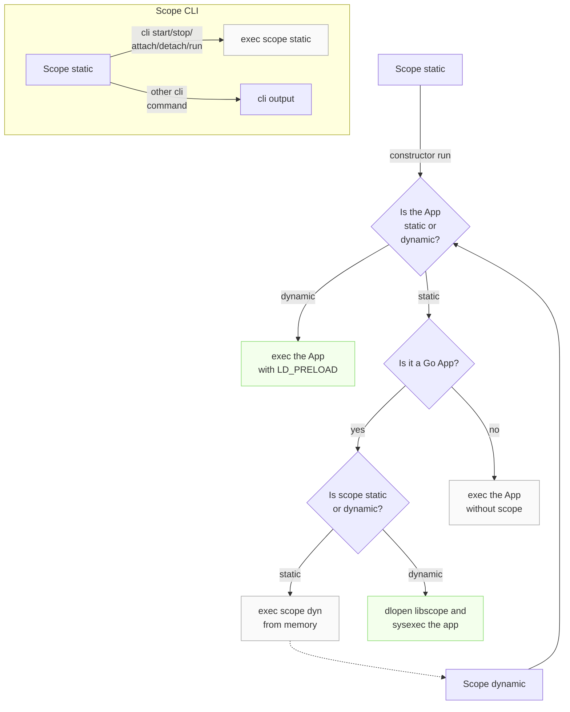

```mermaid
graph TD
  
    A[Scope static]
    A -->|constructor run| B{Is the App \n static or \n dynamic?}
    B -->|dynamic| C[exec the App \n with LD_PRELOAD]
    B -->|static| D{Is it a Go App?}
    D -->|yes| E{Is scope static \n or dynamic?}
    D -->|no| F[exec the App \n without scope]
    E -->|static| G[exec scope dyn \n from memory]
    E -->|dynamic| H[dlopen libscope and \n sysexec the app]
    G -.-> I[Scope dynamic]
    I --> B
 
    style C fill:#f3ffec,stroke:#89db70
    style F fill:#fafafa,stroke:#a6a6a6
    style G fill:#fafafa,stroke:#a6a6a6
    style H fill:#f3ffec,stroke:#89db70
    style T fill:#fafafa,stroke:#a6a6a6
  
    subgraph Scope CLI
    S[Scope static]
    S-->|cli start/stop/ \n attach/detach/run|T[exec scope static]
    S-->|other cli \n command|U[cli output]
    end
```
