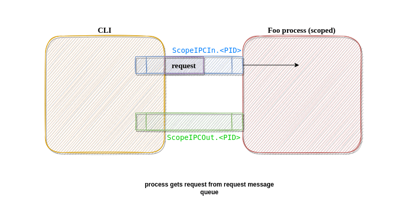

# IPC Notes

- For IPC communication we are using pair of posix message queue:

- The client in the communication is `scope`
- The server in the communication is scoped application
- The message queue created by `scope` is `ScopeIPCOut.<PID>` and `ScopeIPCIn.<PID>`
- scoped application reads from `ScopeIPCIn.<PID>` and writes to `ScopeIPCOut.<PID>`
- `scope` reads from `ScopeIPCOut.<PID>` and writes to `ScopeIPCIn.<PID>`
- The message queues are used in non-blocking way - both by client and server



## Protocol

Initial approach for the protocol between cli and library for IPC communicaiton was based on JSON format.
Unfortunately we cannot use it directly since message queue size restrictions.

Therefore we introduced framing mechanism into the protocol.

The default message takes following form:

Without framing mechanism:

<METADATA_JSON><NUL><SCOPE_JSON>

With framing mechanism:

<METADATA_JSON><NUL><PART_OF_SCOPE_JSON>

## Example

### Scope status request

```
"{\"req\":0,\"uniq\":1234,\"remain\":11}"\x00"{\"req\":0}"
```

#### Request Meta

- `req` - `0`, meta request - describes the message formatting, `0` means the request will be based on complete JSON
- `uniq` - `1234`, unique identifier of the request
- `remain` - `11`,  remaining bytes in the request communication

#### Request Message

- req - `0`, "Get Scope Status" request

### Scope status response

```
"{\"status\":200,\"uniq\":1234,\"remain\":29}"\x00"{\"status\":200,\"scoped\":false}"
```

#### Response Meta

- `status` - `200`, meta status - describes that request, `200` means that request was succesfully handled
- `uniq` - `1234`, unique identifier of the response, value corresponds to the `req` value in handled request
- `remain` - `11`,  remaining bytes in the response communication

#### Response Message

- `status` - `200`, message status - describes that message in request was succesfully handled
- `scoped` - `false`, scoped status - scope status of process - `false` means that we disable interposition


### Framing mechanism

- value `1` in `req` field in request indicates that the request is splitted by multiple frames
- value `206` in `status` field in response indicates that the response is splitted by multiple frames
- in each frame in the request - `uniq` field value must be the same
- in each following frame in the request - `remain` field must decreasing
- in each frame in the response - `uniq` field value must be the same as in the request
- in each following frame in the request - `remain` field must decreasing

## IPC adding new request

Depending on expected logic adding new request required adding handling both on CLI side and library side.

- Adding new request, CLI: `ipcscope.go`
- Adding new request, library: `ipc_scope_req_t` in `ipc.c`
- Adding response for the request, CLI: `ipcscope.go`
- Adding response for the request, library: `*supportedResp` in `ipc.c`
- (Optional) Adding processing request in the library see `ipcProcessSetCfg` as an example
