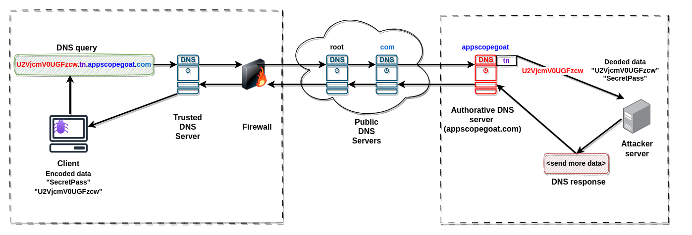

## Introduction DNS

DNS (Domain Name System) is a fundamental internet protocol responsible for translating domain names into IP addresses. DNS is intended to take on the role of a phone book for the internet; therefore, it is a universally used and trusted worldwide protocol. DNS uses port 53, which is almost always open on systems and are not be blocked to prevent DNS traffic from firewalls. Many organizations do not decide to monitor DNS traffic regarding risk activity. The lack of monitoring and restrictions of the DNS protocol is the reason why attackers often abuse DNS as a way of cyberattacks against victim machines. This oversight can have dramatic consequences.

Here is the overview of attack vector using DNS :



Example of these attacks are:

- DNS data exfiltration: This involves transmitting sensitive or unauthorized data from a compromised network to an external destination using DNS queries and responses. For example, we can break up a large amount of sensitive data, encrypt it, split it into small chunks, send it through DNS, and reassemble it on the other side.
- DNS tunneling to establish C2 (command and control): This allows attackers to bypass network security restrictions and establish a channel for command and control between two endpoints using DNS traffic.

There are several [methods](
https://pubmed.ncbi.nlm.nih.gov/36904959/) that can be employed to detect DNS annomalies.

This post will show how AppScope can detect DNS anomalies and send a notification using the Slack channel.

### Prerequisites

You will need:
- Create an Slack application with Bot token using [Slack API](https://api.slack.com/start/quickstart)
- Bot token should have following scope [`chat_write`](https://api.slack.com/scopes/chat:write), [`chart_write_public`](https://api.slack.com/scopes/chat:write.public) to allow push notifications
- Retrieve channel id where bot should post the notifications
- Deploy the Slack application

### Investigating the DNS data

Here is the overview of the solution:


#### Setting Up the AppScope configuration

Here is the example content of AppScope configuration file `SCOPE_CONFIGURATION_FILE` which will be used for scoping the data:

```yml
metric:
  enable: false
event:
  enable: true
  format:
    type: ndjson
    maxeventpersec: 10000
    enhancefs: false
  watch:
    - type: dns
      name: .*
      field: .*
      value: .*
  transport:
    type: tcp
    host: 127.0.0.1
    port: 9999
    tls:
      enable: false
cribl:
  enable: false
```

As you can see we intended to scope `dns` events and send data to `127.0.0.1:9999` using TCP.

#### Scope the application

Below command allows to run and scope specific application `APP_TO_SCOPE` with the `SCOPE_CONFIGURATION_FILE` defined above

```bash
scope run --userconfig <SCOPE_CONFIGURATION_FILE> -- <APP_TO_SCOPE>
```
#### Start the listener

The command below allows you to start the Scope listener/Slack sender, which enables you to:

- Listen for AppScope event data on `127.0.0.1:9999`.
- Process the DNS events to check potential vulnerabilities in DNS requests/responses.
- Send notifications to Slack using the bot token `SLACK_BOT_TOKEN` to a specific `CHANNEL_ID`.

```bash
scope listener --addr 127.0.0.1:9999 --notifytoken <SLACK_BOT_TOKEN> --channelid <CHANNEL_ID>
```

To determine suspicious DNS activity, the 'scope listener' looks in DNS queries/responses for the following:

Unexpectedly long domain names
Unexpected characters in domain names (non-ASCII and capital letters)
Unexpectedly high Shannon Entropy value of specific domains

#### Demo
Here is the example detection of DNS tunneling which is used by [iodine](https://code.kryo.se/iodine/) project


#### Example notification

Here is the overview of example alert notification which can be seen in the Slack:


#### Summary

The following solution was tested with the `iodine`  but give it a shot on your own! Test it out thoroughly! Explore the documentation! Did the blog effectively cover the topic you were interested in? Was the content engaging and easy to understand? We want to know what stood out to you and if there's anything you wish we had included. Your feedback plays a crucial role in shaping the future of AppScope solution. It helps us understand what works well and what we can improve upon to better serve you, our valued readers.
Feel free to join our #AppScope channel in the [Cribl Community Slack](https://cribl.io/community/), where you can share your experiences using AppScope and the exciting things you uncover with it.