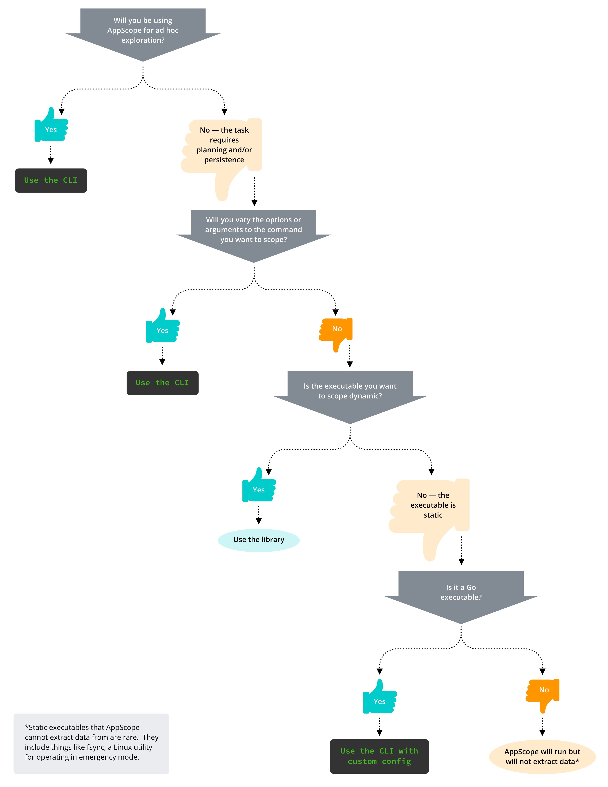

# Working With AppScope

There are three main things to know to work effectively with AppScope:

* Your [overall approach](#ad-hoc-vs-planned) can be either spontaneous or more planned-out.
* You can [control](#config-file-etc) AppScope by means of the config file, environment variables, or a combination of the two.
* The results you get from AppScope will be in the form of [events and metrics](/docs/events-and-metrics).

## Ad Hoc Versus Planned-out {#ad-hoc-vs-planned}

AppScope offers two ways to work:

* Use the CLI when you want to explore in real time, in an ad hoc way.

* Use the AppScope library (`libscope`) for longer-running, planned procedures. 

This is a guiding principle, not a strict rule. Sometimes you may prefer to plan out a CLI session, or, conversely, explore using the library.

Ask yourself whether, as you work, you will vary the options or arguments to the command you want to scope. If you plan to make these kinds of iterative changes, try the CLI; if not, go for the library.

For example:

* You are developing code, and you want to see how its behavior changes as you iterate. **Use the CLI.**

* You are running cURL commands against a website, and want to see what changes when you switch between HTTP/1.1 and HTTP/2.2 and/or HTTP and HTTPS. **Use the CLI.** 

* You are running nginx in a specific, unchanging way dictated by the requirements of your organization, and you want to see metrics. **Use the library.**

Here's a decision tree to help you determine whether to use the CLI or the library.

## The Config File, Env Vars, Flags, and `ldscope` {#config-file-etc}

AppScope's ease of use stems from its flexible set of controls:

* AppScope's configuration file, `scope.yml`, can be invoked from either the CLI or the library.

* The AppScope library provides an extensive set of environment variables, which control settings like metric verbosity and event destinations. Environment variables override config file settings.

* Finally, AppScope provides the `ldscope` utility, whose uses include loading the AppScope library into Go executables.

Check out the [CLI](/docs/cli-using) and [library](/docs/library-using) pages to see how it's done.
