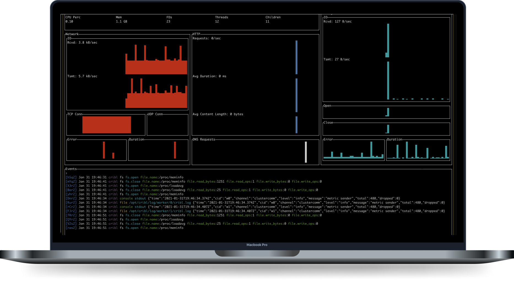

# Overview

## What Is AppScope

AppScope is an open source instrumentation utility for any application, regardless of programming language, with no code modification required.

## Features

AppScope helps users explore, understand, and gain visibility into applications' behavior. Features include:

*   Capture application metrics 
    *   File, Network, Memory, CPU
*   Capture and log application events
    *   Application console content `stdin/out`
    *   Application logs 
    *   Errors 
*   Summarize metrics 
*   Protocol detection 
*   Capture any and all payloads
    *   DNS, HTTP, and HTTPS
*   Emit metrics and events to remote systems
*   Normalize data
*   Monitor static executables
*   All runtimes (runtime-agnostic)
*   No dependencies
*   No code development required

